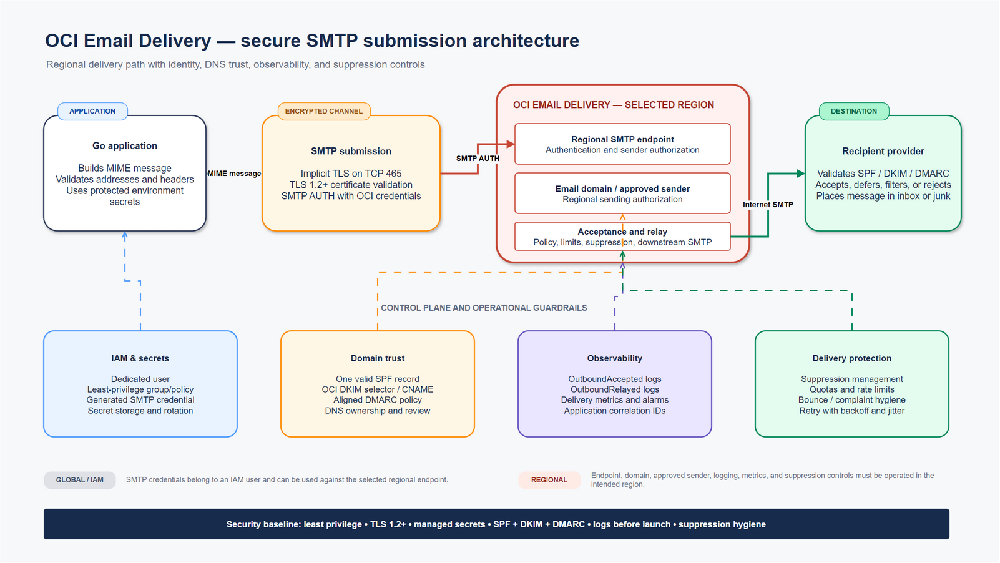

# OCI Email Delivery toolkit

An implementation-ready package for sending application email and file attachments through Oracle Cloud Infrastructure (OCI) Email Delivery. It combines training material, an editable architecture diagram, a detailed configuration runbook, a dependency-free Go SMTP client, and a simple Bash and curl alternative for Linux servers.

> **Disclaimer:** This project is independent and is not affiliated with, endorsed by, or supported by Oracle or any Oracle product team. Validate all settings, limits, prices, and security requirements against the current official Oracle documentation and your organization's policies before production use.

The configuration procedure was revalidated against Oracle's official documentation on 22 September 2026. OCI Console labels, service limits, and realm-specific DNS values can change; values displayed in your tenancy take precedence over examples in this repository.



The editable source is available as [a draw.io diagram](docs/architecture/oci-email-delivery-architecture.drawio).

## What is included

| Path | Purpose |
| --- | --- |
| `presentations/01-oci-email-delivery-foundations.pptx` | Service concepts, architecture, IAM, regionality, and limits |
| `presentations/02-oci-email-delivery-setup.pptx` | Console setup, DNS authentication, approved senders, TLS, and validation |
| `presentations/03-oci-email-delivery-operations-and-go.pptx` | Go integration, secrets, observability, reputation, and troubleshooting |
| `docs/oci-email-delivery-setup.md` | Complete implementation and operations runbook |
| `docs/architecture/oci-email-delivery-architecture.drawio` | Editable system architecture |
| `cmd/oci-smtp-mailer` | Linux Go SMTP client supporting TLS, STARTTLS, text/HTML bodies, and file attachments |
| `scripts/send-email.sh` | Simple Bash and curl alternative for plain-text mail over implicit TLS |
| `tests/test-send-email.sh` | Offline dry-run and input-validation tests for the Bash client |
| `.env.example` | Configuration template containing no credentials |
| `.github/workflows/release.yml` | Test-gated, commit-based GitHub release automation |

## Architecture and service model

The application connects to the public SMTP endpoint for one OCI region. It authenticates with Oracle-generated SMTP credentials belonging to a dedicated IAM user and sends from an approved address or DKIM-enabled domain. OCI evaluates authorization and suppression status, accepts the message, and relays it to the recipient's mail provider.

| Component | Scope | Role |
| --- | --- | --- |
| Email domain | Regional | Establishes a sending domain and hosts DKIM configuration |
| Approved sender | Regional | Authorizes an exact `From` address when domain-based sending is not used |
| SMTP endpoint | Regional | Receives authenticated TLS SMTP submissions |
| SMTP credentials | IAM/global | Username and password generated for an IAM user; not the Console password |
| SPF, DKIM, DMARC | DNS | Authenticate mail and state the domain policy |
| Suppression list | Regional | Blocks delivery to known problematic recipient addresses |
| Metrics and logs | Regional | Show accepted, relayed, bounced, complained, and failed messages |

OCI Email Delivery is a sending service rather than an inbox service: it does not provide IMAP/POP mailboxes or receive replies. Resources and endpoints are regional, so create and operate the email domain, approved sender, logs, suppression entries, and SMTP endpoint in the same intended region.

## Prerequisites

- An OCI tenancy and access to the target region.
- Permission to manage users or groups, policies, Email Delivery resources, and logs.
- Administrative access to the sending domain's public DNS.
- Go 1.21 or later for the full sample client, or Bash plus a curl build with SMTP and TLS support for the simple alternative.
- Outbound network access to the OCI endpoint, normally TCP port `465` for implicit TLS.
- A test recipient that you are authorized to contact.

## Clone the repository

```bash
git clone https://github.com/eugsim1/oci-email-delivery-toolkit.git
cd oci-email-delivery-toolkit
```

## Complete OCI Email Delivery configuration

This section is intentionally self-contained. Complete the steps in order because later resources depend on the earlier identity, regional, and DNS choices. The separate [configuration runbook](docs/oci-email-delivery-setup.md) remains available as a printable operational reference.

### Step 1 — Record the deployment values

Choose the values before creating resources. Keep the regional values together throughout the setup.

| Setting | Example | Why it matters |
| --- | --- | --- |
| OCI region | `eu-frankfurt-1` | Email domains, approved senders, endpoints, logs, and suppressions are regional |
| Compartment | `EmailPlatform` | Scopes resources, policy, ownership, quotas, and cost controls |
| Identity domain | `Default` | Required in IAM group references for identity-domain tenancies |
| Sender group | `oci-email-senders` | Receives only the runtime permission required to send |
| Administrator group | `oci-email-admins` | Manages domains, senders, suppressions, logging, and credentials |
| Service user | `svc-email-prod` | Owns the application SMTP credentials |
| Email domain | `mail.example.com` | Must be a public domain or subdomain controlled by the organization |
| Sender | `no-reply@mail.example.com` | Must be approved in the same region as the SMTP endpoint |
| Linux host | Application server or container | Must reach the regional endpoint on TCP port `465` |

Do not use a public mailbox-provider domain such as `gmail.com`, `hotmail.com`, or `yahoo.com`; the email domain must be one for which you can publish public DNS records. Avoid the root compartment for approved senders so policy can remain compartment-specific.

### Step 2 — Select the target region and compartment

1. Sign in to the OCI Console.
2. Use the region selector in the Console header to select the intended sending region.
3. Open **Identity & Security → Compartments**.
4. Create or select a compartment dedicated to the email workload, such as `EmailPlatform`.
5. Record the compartment name and OCID for operations and automation.
6. Confirm the region again before creating each Email Delivery resource.

SMTP credentials are global IAM credentials, but approved senders, email domains, SMTP endpoints, logs, and suppression lists are regional. To send from a second region, repeat the regional resource configuration there and use that region's endpoint.

### Step 3 — Create dedicated IAM groups and a service user

Use a non-human identity for SMTP rather than an administrator's personal account.

1. Open **Identity & Security → Domains** and select the identity domain that will hold the user, commonly **Default**.
2. Open **Groups** and create `oci-email-senders`.
3. Create `oci-email-admins` if a suitable administration group does not already exist.
4. Open **Users** and create a user such as `svc-email-prod`.
5. Do not grant the service user a Console password unless another documented requirement needs one.
6. Add the service user to `oci-email-senders`.
7. Open the user's capabilities and confirm **Can use SMTP credentials** is enabled. OCI normally enables credential capabilities by default, but an administrator can disable them.
8. Keep human administrators in `oci-email-admins`; do not add the application user to that group.

This separation lets the application submit mail without gaining permission to create domains, remove suppressions, or administer other identities.

### Step 4 — Create least-privilege IAM policies

1. Open **Identity & Security → Policies**.
2. Select the compartment in which your organization manages policies.
3. Select **Create Policy**.
4. Enter a stable name and description.
5. Use the **Email Management** policy-builder use case or enable the manual editor.
6. Replace the example identity domain, group, and compartment names below with your actual values.

Minimum runtime permission:

```text
Allow group 'Default'/'oci-email-senders' to use email-family in compartment EmailPlatform
```

Administrative permissions:

```text
Allow group 'Default'/'oci-email-admins' to manage email-family in compartment EmailPlatform
Allow group 'Default'/'oci-email-admins' to manage credentials in compartment EmailPlatform where target.credential.type = 'smtp'
Allow group 'Default'/'oci-email-admins' to manage suppressions in tenancy
Allow group 'Default'/'oci-email-admins' to manage log-groups in compartment EmailPlatform
Allow group 'Default'/'oci-email-admins' to read log-content in compartment EmailPlatform
```

7. Create the policy and allow a short propagation interval; Oracle states that a new policy normally becomes effective within seconds.
8. Confirm the service user is in the sender group and is not receiving administrative access through another group.

`use email-family` includes the `SmtpSend` permission through `APPROVED_SENDER_USE`. The suppression policy is tenancy-scoped because the regional suppression list is a tenancy-level resource. Identity-domain syntax can differ for older tenancy layouts, so use the policy builder and current OCI policy reference if your tenancy does not accept the quoted `domain/group` form.

### Step 5 — Generate and store SMTP credentials

1. Open the dedicated user's details:
   - For an administrator: **Identity & Security → Domains → _identity-domain_ → Users → _service-user_**.
   - For your own user: open the profile menu and select **User settings**.
2. Under the user's resources, select **SMTP credentials**.
3. Select **Generate SMTP credentials**.
4. Enter a description containing the application, environment, intended region, and creation date.
5. Select **Generate credentials**.
6. Immediately copy both the generated username and password to an approved secret manager.
7. Verify that both values are recoverable from the secret manager before closing the dialog. OCI does not display the password again.

Do not substitute the Console password, user OCID, auth token, API key fingerprint, or private key. SMTP credentials are Oracle-generated, do not expire automatically, and each IAM user can hold at most two at a time. The two-credential limit enables overlap during rotation.

### Step 6 — Create the regional email domain

1. Confirm the selected OCI region.
2. Open **Developer Services → Application Integration → Email Delivery**.
3. Select **Email Domains**.
4. Select the target compartment.
5. Select **Create Email Domain**.
6. Enter the exact domain after `@` in the planned sender, for example `mail.example.com`.
7. Add organization-required tags, if any.
8. Select **Create** and record the email-domain OCID.

The domain must be publicly registered and controlled in DNS. A resource for `mail.example.com` covers that exact domain, not `example.com` or a different subdomain.

### Step 7 — Enable acceptance and relay logs before testing

1. Open the newly created email domain.
2. Select **Logs**, or open the **Email Deliverability and Reputation Governance** dashboard.
3. Enable **Outbound Accepted** (`OutboundAccepted`).
4. Enable **Outbound Relayed** (`OutboundRelayed`).
5. Select or create the appropriate log group and configure retention according to policy.
6. Open **Observability & Management → Logging → Log Search** and confirm administrators can access the selected log group.

`OutboundAccepted` records successful and failed submissions, invalid senders, and suppressed recipients. `OutboundRelayed` records downstream relay, bounces, complaints, unsubscribes, opens, and clicks. Enabling both prevents an SMTP acceptance response from being mistaken for confirmed delivery.

### Step 8 — Publish SPF

1. Query the sending domain's current TXT records before making a change:

   ```bash
   dig +short TXT mail.example.com
   ```

2. Copy the SPF value shown for the target configuration in OCI or use the applicable documented commercial-region value:

   | Sending geography | SPF TXT value |
   | --- | --- |
   | Americas | `v=spf1 include:rp.oracleemaildelivery.com ~all` |
   | Asia/Pacific | `v=spf1 include:ap.rp.oracleemaildelivery.com ~all` |
   | Europe | `v=spf1 include:eu.rp.oracleemaildelivery.com ~all` |
   | All commercial regions | `v=spf1 include:rp.oracleemaildelivery.com include:ap.rp.oracleemaildelivery.com include:eu.rp.oracleemaildelivery.com ~all` |

3. At the authoritative DNS provider, create a TXT record on the sending/return-path domain.
4. If an SPF record already exists, merge the OCI `include` mechanism into that record. Never publish multiple independent `v=spf1` TXT records at the same name.
5. Wait for DNS propagation and verify from a public resolver:

   ```bash
   dig +short TXT mail.example.com @1.1.1.1
   ```

6. Confirm that the final record remains within SPF's DNS-lookup constraints and preserves any other legitimate senders.

For government or sovereign realms, use the realm-specific value in the OCI Console and official documentation rather than the commercial examples above.

### Step 9 — Configure DKIM and publish the DNS record

1. Open **Email Delivery → Email Domains** and select the domain.
2. Select **DKIM → Add DKIM**.
3. Select **Add new DKIM**, then **Next**.
4. Enter a rotation-friendly selector, for example `oci2026a`. OCI permits up to 63 lowercase alphanumeric characters and dashes.
5. Select **Next → Generate DKIM Record**.
6. Copy the generated CNAME record name and CNAME target exactly. Non-commercial realms may instead provide a DKIM TXT value.
7. Publish the record at the authoritative DNS provider. Do not append the domain twice if the DNS provider automatically adds the zone name.
8. Return to OCI and select **Add DKIM**.
9. Verify public DNS after propagation:

   ```bash
   dig +short CNAME '<selector>._domainkey.mail.example.com' @1.1.1.1
   ```

10. Wait until OCI reports DKIM signing as active before creating a domain-wide approved sender.

OCI supports two DKIM keys per email domain but only one active key at a time. Oracle recommends rotating DKIM keys every six months. Only approved senders whose domain exactly matches the configured email domain receive that domain's signature.

### Step 10 — Publish a staged DMARC policy

DMARC is not configured in the OCI Console; it is a DNS policy for the visible `From` domain.

1. Create a mailbox or reporting service capable of receiving DMARC aggregate reports.
2. Publish a TXT record at `_dmarc.<sending-domain>` with an initial monitoring policy, for example:

   ```text
   v=DMARC1; p=none; rua=mailto:dmarc-reports@example.com; fo=1
   ```

3. Verify it publicly:

   ```bash
   dig +short TXT _dmarc.mail.example.com @1.1.1.1
   ```

4. Review reports until every legitimate sender is aligned through SPF and/or DKIM.
5. Move deliberately to `p=quarantine` and then `p=reject` only after confirming the effect on all mail sources.

OCI Email Delivery does not provide an inbox or automated DMARC report processing. The reporting mailbox must be hosted elsewhere.

### Step 11 — Create the regional approved sender

1. Confirm the OCI Console is still in the intended sending region.
2. Open **Email Delivery → Approved Senders**.
3. Select the target non-root compartment.
4. Select **Create Approved Sender**.
5. Enter the exact visible `From` address, for example `no-reply@mail.example.com`.
6. Add tags if required and select **Create Approved Sender**.
7. Allow a short propagation interval before the first send. Retry an immediate authorization failure with backoff.

Every `From` address must be approved. To authorize every address in a domain, first make DKIM active and then create the approved sender as `@mail.example.com`. Approved senders are unique to a region; repeat this step in every sending region.

### Step 12 — Optionally configure a custom return path

A custom return path can improve alignment and branding, but Oracle recommends prioritizing DKIM first.

1. Choose a regional subdomain such as `<region-key>.rp.mail.example.com`.
2. In the email-domain settings, create the custom return path using a domain that matches or is a subdomain of the approved sender's domain.
3. Publish the exact MX target shown by OCI. For commercial regions the documented pattern is:

   ```text
   10 bmta.email.<region-identifier>.oci.oraclecloud.com
   ```

4. Publish the applicable regional SPF record on the return-path subdomain.
5. Verify the MX and TXT records from a public resolver.
6. Wait until OCI reports the return path as active before relying on it.

Always use the exact region identifier and Console-generated values. A return-path record for one region must not be reused blindly in another region or realm.

### Step 13 — Copy the regional SMTP endpoint and TLS mode

1. Open **Email Delivery → Configuration** in the target region.
2. In the SMTP sending information panel, copy the **Public endpoint**.
3. Record port `465` and implicit TLS as the primary connection mode.
4. Do not guess an endpoint from its naming pattern, particularly in sovereign realms.

Typical commercial endpoint form:

```text
smtp.email.<region>.oci.oraclecloud.com:465
```

OCI requires encryption in transit. Port `465` negotiates TLS as soon as the connection starts rather than first establishing a plaintext SMTP session and upgrading with STARTTLS.

### Step 14 — Confirm service limits, quotas, and network egress

1. Open **Governance & Administration → Limits, Quotas and Usage**.
2. Filter for Email Delivery and record the tenancy's current daily volume, send rate, approved-sender count, domain count, and maximum message size.
3. If compartment quotas are used, confirm that `max-emails-day`, `sendrate`, `max-message-size`, `approved-sender-count`, and `email-domain-count` permit the workload.
4. From the Linux runtime host, validate DNS resolution and the TLS path:

   ```bash
   getent ahosts smtp.email.eu-frankfurt-1.oci.oraclecloud.com
   openssl s_client \
     -connect smtp.email.eu-frankfurt-1.oci.oraclecloud.com:465 \
     -servername smtp.email.eu-frankfurt-1.oci.oraclecloud.com \
     -brief </dev/null
   ```

5. If the connection fails, review outbound firewall, proxy, NAT, route-table, network-security-group, security-list, and host-firewall rules. Only outbound connectivity is required; do not expose an inbound SMTP listener.
6. Complete SPF and DKIM before requesting a limit increase. Check the actual Console limits because account type and approved increases can change the defaults.

## Linux clients and shared configuration

Linux is the primary supported runtime. Choose the Bash client for a small plain-text submission with no compilation, or the Go client for HTML, attachments, STARTTLS, encoded-size enforcement, richer MIME handling, and stricter mailbox parsing. Both send one message and exit; neither is a long-running SMTP server or opens an inbound network port.

The program reads environment variables directly; it intentionally does not parse `.env` files. In production, inject values from a secret manager, container secret, protected service environment, or root-controlled environment file.

| Variable | Required | Default | Description |
| --- | --- | --- | --- |
| `OCI_SMTP_HOST` | Yes | — | Exact regional public SMTP endpoint copied from OCI |
| `OCI_SMTP_PORT` | No | `465` | SMTP port |
| `OCI_SMTP_MODE` | Go only | `tls` | `tls` for implicit TLS or `starttls`; Bash always uses implicit TLS |
| `OCI_SMTP_USERNAME` | Yes | — | Oracle-generated SMTP username |
| `OCI_SMTP_PASSWORD` | Yes | — | Oracle-generated SMTP password |
| `OCI_EMAIL_FROM` | Yes | — | Authorized sender address |
| `OCI_EMAIL_TO` | Yes | — | Comma-separated recipient list |
| `OCI_EMAIL_CC` | No | empty | Comma-separated CC list |
| `OCI_EMAIL_SUBJECT` | No | `OCI Email Delivery test` | Message subject; CR/LF is rejected |
| `OCI_EMAIL_TEXT` | Yes for Bash; conditional for Go | empty | Plain-text body; the Go client accepts text, HTML, or both |
| `OCI_EMAIL_HTML` | Go only | empty | HTML body |
| `OCI_EMAIL_ATTACHMENTS` | Go only | empty | Linux colon-separated attachment paths; relative paths use the process working directory |
| `OCI_EMAIL_MAX_BYTES` | Go only | `2000000` | Maximum complete encoded MIME size, including headers and base64 |
| `OCI_SMTP_TIMEOUT` | Go only | `30s` | Positive Go duration for network operations |
| `OCI_CURL_CONNECT_TIMEOUT` | Bash only | `30` | Positive integer connection timeout in seconds |

Copy `.env.example` only as a field reference. Never commit a populated copy.

## Bash and curl alternative

[`scripts/send-email.sh`](scripts/send-email.sh) uses curl's SMTP support to submit a plain-text MIME message to OCI over implicit TLS on port `465`. It supports comma-separated To and CC recipients and shares the core environment variables with the Go client. It intentionally does not support HTML, attachments, STARTTLS, display-name addresses, BCC, or full internationalized-header encoding; use the Go client when those capabilities are required.

The Bash client requires:

- Bash;
- `curl` built with SMTP and TLS support;
- `mktemp`, `date`, and standard Linux core utilities; and
- outbound connectivity to the exact regional SMTP hostname on port `465`.

Check the installed curl protocols before use:

```bash
curl --version
curl --version | grep -E 'Protocols:.*smtps'
```

### Bash example 1 — Send a basic message

Prompt for the Oracle-generated SMTP password so it is not written to shell history:

```bash
export OCI_SMTP_HOST='smtp.email.eu-frankfurt-1.oci.oraclecloud.com'
export OCI_SMTP_PORT='465'
export OCI_SMTP_USERNAME='<oracle-generated-smtp-user>'
read -rsp 'OCI SMTP password: ' OCI_SMTP_PASSWORD
printf '\n'
export OCI_SMTP_PASSWORD

export OCI_EMAIL_FROM='no-reply@mail.example.com'
export OCI_EMAIL_TO='recipient@example.net'
export OCI_EMAIL_SUBJECT='OCI Email Delivery Bash test'
export OCI_EMAIL_TEXT='Hello from OCI Email Delivery using Bash and curl.'

./scripts/send-email.sh
unset OCI_SMTP_PASSWORD OCI_SMTP_USERNAME
```

Expected success output:

```text
Email accepted by OCI Email Delivery for 1 recipient(s).
```

SMTP acceptance is not confirmation of inbox delivery. Verify `OutboundAccepted`, `OutboundRelayed`, and the recipient mailbox.

### Bash example 2 — Multiple To and CC recipients

Use comma-separated bare addresses and a multiline plain-text body:

```bash
export OCI_EMAIL_TO='first@example.net,second@example.net'
export OCI_EMAIL_CC='audit@example.net,operations@example.net'
export OCI_EMAIL_SUBJECT='Nightly processing summary'
export OCI_EMAIL_TEXT=$'The nightly process completed.\nReview the OCI logs for delivery status.'

./scripts/send-email.sh
```

The success count includes both To and CC envelope recipients.

### Bash example 3 — Load a protected environment file

The script does not parse `.env` automatically. Source a root-controlled file only if its contents and ownership are trusted:

```bash
sudo -u oci-mailer sh -c '
  set -a
  . /etc/oci-smtp-mailer/runtime.env
  set +a
  exec /opt/oci-email-delivery-toolkit/scripts/send-email.sh
'
```

Add `OCI_CURL_CONNECT_TIMEOUT=30` to that file when the default is not suitable. Keep the file owned by `root:oci-mailer` with mode `0640`, as described in the protected runtime configuration below.

### Bash example 4 — Inspect the MIME message without sending

Dry-run mode validates the sender, recipient lists, subject, and body but does not require curl, the SMTP endpoint, or credentials:

```bash
umask 077
OCI_EMAIL_FROM='no-reply@mail.example.com' \
OCI_EMAIL_TO='recipient@example.net' \
OCI_EMAIL_SUBJECT='Dry-run inspection' \
OCI_EMAIL_TEXT='No network connection is made.' \
./scripts/send-email.sh --dry-run > /tmp/oci-bash-message.eml

sed -n '1,30p' /tmp/oci-bash-message.eml
rm -f /tmp/oci-bash-message.eml
```

Treat the `.eml` output as sensitive whenever the message contains confidential information.

### Bash security behavior and limitations

- The SMTP URL is always `smtps://` and curl is instructed to require TLS 1.2 or newer and validate the server certificate.
- The script rejects CR/LF in sender, recipient, subject, username, and password values to reduce header and curl-configuration injection risk.
- Recipient fields accept bare addresses only, such as `recipient@example.net`; use the Go client for display names and fuller RFC mailbox parsing.
- The SMTP username and password are written only to a mode-`0600` temporary curl configuration file, rather than command-line arguments, and removed by an exit trap.
- The credential still exists in the script's environment and protected temporary file during execution. Run under a dedicated account and use an approved secret-injection mechanism.
- Plain-text bodies are emitted as UTF-8. Use the Go client for HTML, attachments, MIME-safe internationalized headers, message-size enforcement, or STARTTLS.

## Go SMTP client

### Command-line flags

| Flag | Repeatable | Description |
| --- | --- | --- |
| `-attachment PATH` | Yes | Attach a regular file. Each use adds one file after any paths in `OCI_EMAIL_ATTACHMENTS`. |
| `-max-message-bytes N` | No | Override `OCI_EMAIL_MAX_BYTES` for this invocation. `N` is a positive encoded-message limit in bytes; `0` keeps the environment/default value. |
| `-dry-run` | No | Write the complete MIME message to standard output and make no network connection. |
| `-h` | No | Print flag help and exit. |

Environment variables hold connection and message defaults; flags are intended for per-run attachment paths, a controlled size override, and inspection. Never pass the SMTP password as a command-line flag because process arguments can be visible to other users and monitoring tools.

### Build on Linux

1. Confirm that Go 1.21 or later is installed:

   ```bash
   go version
   ```

2. Clone, test, vet, and build the project:

   ```bash
   git clone https://github.com/eugsim1/oci-email-delivery-toolkit.git
   cd oci-email-delivery-toolkit
   go test ./...
   go vet ./...
   mkdir -p bin
   go build -trimpath -o bin/oci-smtp-mailer ./cmd/oci-smtp-mailer
   ```

3. Inspect the executable and optionally install it system-wide:

   ```bash
   file bin/oci-smtp-mailer
   ./bin/oci-smtp-mailer -h
   sudo install -o root -g root -m 0755 \
     bin/oci-smtp-mailer /usr/local/bin/oci-smtp-mailer
   ```

No third-party Go modules are required. For a reproducible build, compile the same commit that passed CI and record `git rev-parse HEAD` with the deployed artifact.

### First Linux test using the current shell

Use placeholders until OCI setup is complete. Prompt for the password so the real value is not stored in shell history:

```bash
export OCI_SMTP_HOST='smtp.email.eu-frankfurt-1.oci.oraclecloud.com'
export OCI_SMTP_PORT='465'
export OCI_SMTP_MODE='tls'
export OCI_SMTP_USERNAME='<oracle-generated-smtp-user>'
read -rsp 'OCI SMTP password: ' OCI_SMTP_PASSWORD
printf '\n'
export OCI_SMTP_PASSWORD
export OCI_EMAIL_FROM='no-reply@mail.example.com'
export OCI_EMAIL_TO='recipient@example.net'
export OCI_EMAIL_CC=''
export OCI_EMAIL_SUBJECT='OCI Email Delivery validation'
export OCI_EMAIL_TEXT='This message validates the OCI SMTP configuration.'
export OCI_EMAIL_HTML=''
export OCI_EMAIL_ATTACHMENTS=''
export OCI_EMAIL_MAX_BYTES='2000000'
export OCI_SMTP_TIMEOUT='30s'

go run ./cmd/oci-smtp-mailer

unset OCI_SMTP_PASSWORD OCI_SMTP_USERNAME
```

Replace the hostname with the endpoint copied from **Email Delivery → Configuration**, and make `OCI_EMAIL_FROM` exactly match the regional approved sender or DKIM-enabled approved domain.

### Protected Linux runtime configuration

For a standalone host, run the binary as a non-login OS account and restrict the environment file. A production secret manager is preferable when available.

1. Create the runtime identity and configuration directory:

   ```bash
   sudo useradd --system --home-dir /nonexistent \
     --shell /usr/sbin/nologin oci-mailer
   sudo install -d -o root -g oci-mailer -m 0750 /etc/oci-smtp-mailer
   sudoedit /etc/oci-smtp-mailer/runtime.env
   ```

2. Add the variables to `runtime.env` without an `export` prefix:

   ```bash
   OCI_SMTP_HOST='smtp.email.eu-frankfurt-1.oci.oraclecloud.com'
   OCI_SMTP_PORT='465'
   OCI_SMTP_MODE='tls'
   OCI_SMTP_USERNAME='<oracle-generated-smtp-user>'
   OCI_SMTP_PASSWORD='<oracle-generated-smtp-password>'
   OCI_EMAIL_FROM='no-reply@mail.example.com'
   OCI_EMAIL_TO='recipient@example.net'
   OCI_EMAIL_CC=''
   OCI_EMAIL_SUBJECT='OCI Email Delivery validation'
   OCI_EMAIL_TEXT='This message validates the OCI SMTP configuration.'
   OCI_EMAIL_HTML=''
   OCI_EMAIL_ATTACHMENTS=''
   OCI_EMAIL_MAX_BYTES='2000000'
   OCI_SMTP_TIMEOUT='30s'
   ```

3. Restrict ownership and permissions:

   ```bash
   sudo chown root:oci-mailer /etc/oci-smtp-mailer/runtime.env
   sudo chmod 0640 /etc/oci-smtp-mailer/runtime.env
   ```

4. Run one controlled submission as the non-login account:

   ```bash
   sudo -u oci-mailer sh -c '
     set -a
     . /etc/oci-smtp-mailer/runtime.env
     set +a
     exec /usr/local/bin/oci-smtp-mailer
   '
   ```

Do not store credentials in command-line arguments, world-readable files, container images, GitHub Actions variables printed to logs, or source control. When the invoking application supplies per-message recipients, subjects, and bodies, expose only the SMTP connection values through its secret mechanism and set message values immediately before execution.

A successful submission prints:

```text
Email accepted by OCI Email Delivery for 1 recipient(s).
```

This confirms SMTP acceptance, not inbox placement. Check OCI relay logs and the receiving system afterward.

### Multiple recipients and HTML

Use comma-separated address lists. Set both bodies to generate a `multipart/alternative` message:

```bash
export OCI_EMAIL_TO='first@example.net,second@example.net'
export OCI_EMAIL_CC='audit@example.net'
export OCI_EMAIL_TEXT='This is the plain-text version.'
export OCI_EMAIL_HTML='<p>This is the <strong>HTML</strong> version.</p>'
./bin/oci-smtp-mailer
```

### Send one attachment

Pass an absolute Linux path when the invocation may run from different working directories:

```bash
export OCI_EMAIL_SUBJECT='Monthly report'
export OCI_EMAIL_TEXT='The monthly PDF report is attached.'
./bin/oci-smtp-mailer \
  -attachment /srv/reports/monthly-report.pdf
```

The program reads the file before connecting to OCI, uses only its base filename (`monthly-report.pdf`) in the email, detects the MIME media type from the extension, and base64-encodes the content. If the extension is unknown, it uses `application/octet-stream`. The attachment must resolve to a regular file readable by the runtime account; directories, devices, duplicate paths, and missing files are rejected.

### Send multiple attachments

Repeat `-attachment` for the clearest per-run invocation:

```bash
./bin/oci-smtp-mailer \
  -attachment /srv/reports/monthly-report.pdf \
  -attachment /srv/reports/monthly-summary.csv
```

For a fixed Linux service configuration, use a colon-separated path list:

```bash
export OCI_EMAIL_ATTACHMENTS='/srv/reports/monthly-report.pdf:/srv/reports/monthly-summary.csv'
./bin/oci-smtp-mailer
```

Paths supplied with `-attachment` are appended after paths from `OCI_EMAIL_ATTACHMENTS`. Do not specify the same absolute path in both places; the program rejects duplicates so an attachment is not sent twice accidentally.

### Message-size limit

OCI documents a default maximum message size of 2 MB, including headers, body, attachments, and base64 expansion. The client therefore uses a conservative `OCI_EMAIL_MAX_BYTES` default of `2000000` and validates the final encoded MIME message before opening an SMTP connection. Base64 usually adds about one third to the raw file size, and MIME headers and boundaries add more, so a raw file close to 2 MB will not fit in the default limit.

If Oracle has approved a larger limit for the tenancy, set the approved encoded limit persistently or override it for one invocation:

```bash
export OCI_EMAIL_MAX_BYTES='10000000'
./bin/oci-smtp-mailer -attachment /srv/reports/large-report.pdf

# Equivalent one-run override:
./bin/oci-smtp-mailer \
  -max-message-bytes 10000000 \
  -attachment /srv/reports/large-report.pdf
```

Do not raise the client limit merely to bypass a local error. First confirm the active tenancy limit in **Governance & Administration → Limits, Quotas and Usage** and obtain the required OCI limit increase. Oracle requires SPF and DKIM before considering an increase and currently documents a maximum approved message size of 60 MB.

### Dry run

Inspect the generated MIME message without contacting OCI. Redirect attachment-bearing output to a protected file because it contains the base64-encoded attachment data:

```bash
umask 077
./bin/oci-smtp-mailer \
  -dry-run \
  -attachment /srv/reports/monthly-report.pdf \
  > /tmp/oci-message.eml

sed -n '1,40p' /tmp/oci-message.eml
rm -f /tmp/oci-message.eml
```

The dry run requires valid `OCI_EMAIL_FROM`, `OCI_EMAIL_TO`, body, attachment, and size settings, but it does not require the SMTP host or credentials. It never prints a password or opens a network connection. Treat the generated `.eml` file as sensitive if the message or attachments contain confidential data.

## Go client security behavior

- Requires TLS 1.2 or newer and validates the SMTP server certificate.
- Supports implicit TLS and STARTTLS; it never silently falls back to plaintext.
- Rejects CR/LF in headers to prevent header injection.
- Parses and validates mailbox addresses before connecting.
- Generates MIME-safe subjects, bodies, boundaries, dates, message IDs, and attachment metadata.
- Accepts only readable regular-file attachments, strips directory paths from MIME filenames, rejects duplicate absolute paths, and uses a safe fallback media type.
- Wraps attachment base64 at the MIME-standard 76-character line length.
- Rejects the final encoded message if it exceeds the configured limit before contacting OCI.
- Does not log SMTP credentials or message bodies during a normal send.
- Uses configurable connection and command deadlines.

## Build and test

```bash
go test ./...
go vet ./...
go build -o oci-smtp-mailer ./cmd/oci-smtp-mailer
bash -n scripts/send-email.sh tests/test-send-email.sh
bash tests/test-send-email.sh
```

No third-party Go modules are required. Go tests cover address parsing, header-injection rejection, multipart construction, validation, and configuration defaults. Bash tests exercise dry-run MIME generation, multiple recipients, and rejection of header injection and invalid addresses without contacting OCI.

## Delivery validation

Validate each layer independently:

1. The client completes SMTP authentication and receives an acceptance response.
2. `OutboundAccepted` contains the submission.
3. `OutboundRelayed` records the downstream relay outcome.
4. The recipient receives the message, including in spam/junk checks.
5. The received headers report expected SPF, DKIM, and DMARC results.
6. Bounces and complaints remain within organizational thresholds.

An accepted SMTP transaction is not a guarantee of delivery. Recipient providers can defer, filter, reject, or place mail in junk folders.

## Limits and capacity planning

OCI applies service limits and reputation controls that can vary by tenancy, region, account history, and service updates. Review the Console and current official documentation rather than hard-coding assumptions.

Plan for:

- approved-sender and domain counts;
- daily or rolling sending volume;
- maximum recipients per message;
- message size and attachment expansion from base64 encoding;
- concurrent SMTP connections and submission rate;
- suppression-list effects and retry behavior.

For high-volume workloads, queue messages, apply bounded concurrency, use exponential backoff with jitter for temporary failures, and make retries idempotent. Do not retry permanent authentication, authorization, or invalid-recipient errors indefinitely.

## Monitoring and operations

- Enable `OutboundAccepted` and `OutboundRelayed` logs before production traffic.
- Monitor accepted, relayed, bounced, complained, and failed message counts and ratios.
- Alert on authentication failures, sudden bounce/complaint increases, sustained throttling, and unexpected volume changes.
- Correlate application message IDs with OCI logs without exposing recipient data unnecessarily.
- Inspect the suppression list when valid recipients stop receiving messages. Remove an entry only after fixing the underlying problem and confirming the address should receive mail.
- Warm new domains and sending patterns gradually. Maintain consent, unsubscribe handling, list hygiene, and predictable traffic.

## Credential rotation

OCI permits a limited number of SMTP credentials per IAM user. A safe rotation is:

1. Generate a second credential.
2. Store it in the approved secret manager.
3. Deploy the new credential without deleting the old one.
4. Send and trace a controlled test message.
5. Confirm the new credential is active everywhere.
6. Delete the old credential and record the rotation.

Never commit SMTP credentials, paste them into tickets or presentations, or reuse the OCI Console password.

## Troubleshooting

| Symptom | Likely cause | Checks and action |
| --- | --- | --- |
| `535 Authentication failed` | Wrong credential type, stale secret, or copied value | Use the Oracle-generated SMTP username/password; rotate if uncertain |
| `curl: (67) Login denied` | Bash client received rejected SMTP credentials | Confirm the Oracle-generated username/password and rotate the credential if uncertain |
| `curl: (60) SSL certificate problem` | Local CA trust, interception, hostname, or clock issue | Do not disable certificate validation; verify the endpoint, CA bundle, TLS interception policy, and system time |
| Bash client rejects an address | Display name, whitespace, angle brackets, or malformed bare address | Supply comma-separated bare addresses such as `recipient@example.net`, or use the Go client for display names |
| Sender not authorized | Sender or domain not approved in the endpoint's region | Verify the exact `From`, email domain/DKIM status, compartment, and region |
| TLS/connect timeout | Egress, firewall, proxy, DNS, endpoint, or port issue | Test name resolution and TCP 465; copy the endpoint from OCI |
| Accepted but not received | Relay failure, suppression, filtering, or reputation | Check both OCI log types, suppression list, bounce response, and recipient junk folder |
| SPF fail | Incorrect or duplicated SPF record | Query public DNS and consolidate to one valid SPF TXT record |
| DKIM fail | Wrong selector/target or propagation delay | Compare the published CNAME exactly with OCI and recheck activation |
| DMARC fail | Visible `From` is not aligned with authenticated domain | Inspect message headers and align SPF and/or DKIM with the `From` domain |
| Throttling | Current rate or volume exceeds an applicable limit | Queue, back off with jitter, reduce concurrency, and review service limits |
| `attachment error: open ...` | Missing path or Linux runtime account lacks access | Use an absolute path and grant the service account read access without making the file world-readable |
| `is not a regular file` | Path identifies a directory, device, socket, or pipe | Attach a regular file; create an immutable export first if the source is streamed data |
| Duplicate attachment error | Same absolute path appears in the environment and/or flags | Remove the duplicate from `OCI_EMAIL_ATTACHMENTS` or `-attachment` arguments |
| Encoded message exceeds limit | Body plus base64-expanded attachments is too large | Reduce or split files, use a secure download link, or set only an OCI-approved larger limit |

The [full runbook](docs/oci-email-delivery-setup.md) contains a longer troubleshooting matrix and production-readiness checklist.

## Production readiness checklist

- [ ] The target region and non-root compartment are documented.
- [ ] A dedicated non-human IAM user owns the SMTP credentials.
- [ ] The runtime group has `use email-family` and no unnecessary administration permissions.
- [ ] The SMTP username and password are held in a secret manager or protected Linux runtime configuration.
- [ ] The email domain exists in every region that will send mail.
- [ ] `OutboundAccepted` and `OutboundRelayed` logs are enabled and searchable.
- [ ] Public DNS returns one valid SPF record containing the correct regional OCI include.
- [ ] OCI reports the DKIM selector as active and a received test message passes DKIM.
- [ ] DMARC reports are monitored before moving beyond `p=none`.
- [ ] The exact sender or DKIM-enabled `@domain` sender is approved in the endpoint's region.
- [ ] Linux DNS resolution and implicit TLS connectivity to port `465` have been tested.
- [ ] The application uses the endpoint copied from the OCI Configuration page.
- [ ] The selected client passes its Go or Bash tests and a dry-run MIME inspection.
- [ ] Every attachment path is absolute, readable only by intended runtime identities, and points to a regular file.
- [ ] The configured encoded-message limit matches the active OCI tenancy limit, and representative attachments pass dry-run validation.
- [ ] A controlled live message appears in accepted and relayed logs and reaches the test mailbox.
- [ ] Tenancy limits and compartment quotas cover planned recipients, rate, and encoded message size.
- [ ] Retry logic backs off on temporary errors and does not retry permanent failures indefinitely.
- [ ] Bounce, complaint, unsubscribe, and suppression-list operating procedures have named owners.
- [ ] SMTP credential and DKIM rotation procedures are scheduled and tested.

## Release automation

Every push to `main` runs Go tests, `go vet`, Bash syntax validation, and offline Bash dry-run tests. After they succeed, the workflow creates exactly one GitHub release for that commit:

- the tag is `commit-<full-git-sha>`, so reruns are idempotent;
- the title and notes come from the newest `##` section in `CHANGELOG.md`;
- the release includes a source ZIP generated from the tested commit;
- only the release job receives `contents: write`; all other workflow permissions are read-only.

## Official references

- [OCI Email Delivery getting-started sequence](https://docs.oracle.com/en-us/iaas/Content/Email/Reference/gettingstarted.htm)
- [Email Delivery overview, regionality, and limits](https://docs.oracle.com/en-us/iaas/Content/Email/Concepts/overview.htm)
- [Creating Email Delivery IAM policies](https://docs.oracle.com/en-us/iaas/Content/Email/Reference/gettingstarted_topic-create-policy.htm)
- [Creating SMTP credentials](https://docs.oracle.com/en-us/iaas/Content/Email/Concepts/create-smtp-credentials.htm)
- [Creating an email domain and optional return path](https://docs.oracle.com/en-us/iaas/Content/Email/Reference/gettingstarted_topic-create-email-domain.htm)
- [Configuring SPF](https://docs.oracle.com/en-us/iaas/Content/Email/Tasks/configurespf.htm)
- [Creating a DKIM record](https://docs.oracle.com/en-us/iaas/Content/Email/Tasks/managing_dkim-create_dkim_record.htm)
- [Creating an approved sender](https://docs.oracle.com/en-us/iaas/Content/Email/Reference/gettingstarted_topic-Create_an_approved_sender.htm)
- [Configuring the encrypted SMTP connection](https://docs.oracle.com/en-us/iaas/Content/Email/Reference/gettingstarted_topic-Configure_the_SMTP_connection.htm)
- [Email Delivery IAM policy reference](https://docs.oracle.com/en-us/iaas/Content/Identity/policyreference/emailpolicyreference.htm)
- [Metrics and logs](https://docs.oracle.com/en-us/iaas/Content/Email/Reference/guide-to-metrics-logs.htm)
- [Searching Email Delivery logs](https://docs.oracle.com/en-us/iaas/Content/Email/Reference/log-guide.htm)
- [Managing the suppression list](https://docs.oracle.com/en-us/iaas/Content/Email/Tasks/managingsuppressionlist.htm)

## License

Released under the [MIT License](LICENSE).
